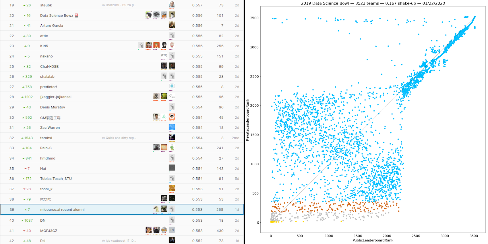

# In this repository you could find solution of the 2019 Data Science Bowl competition on Kaggle platform. We took 39-th place out of 3497 participants (Top 2%, silver medal).
## Big respect to my teammates - [Tatiana Glazkova](https://www.linkedin.com/in/glazkovads/) and [Andrew Ponomarev](https://www.linkedin.com/in/andrew-ponomarev-ba361954/)

## It was really hard to avoid shake-up and get stable model. Look at right picture (thanks to [James Trotman](https://www.linkedin.com/in/jtrotman/) for pic.). It clearly shows the problem.. 
 

How to reproduce solution:
  1. Download input data from https://www.kaggle.com/c/data-science-bowl-2019/data
  1. Create directory with name "input" in root directory
  1. Unzip all files to "input" directory
  1. Open ./scripts/final_solution.ipynb
  1. Run this notebook
  1. Wait...
  1. Answers will be stored in "submission.csv"

